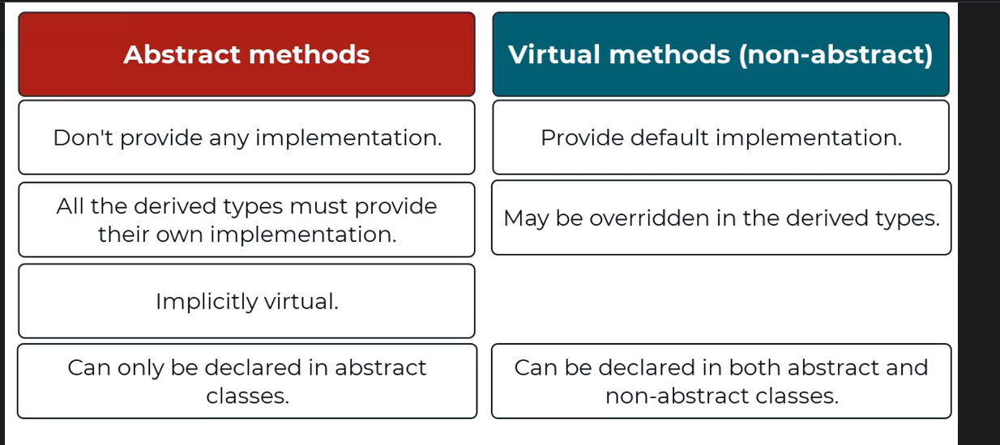
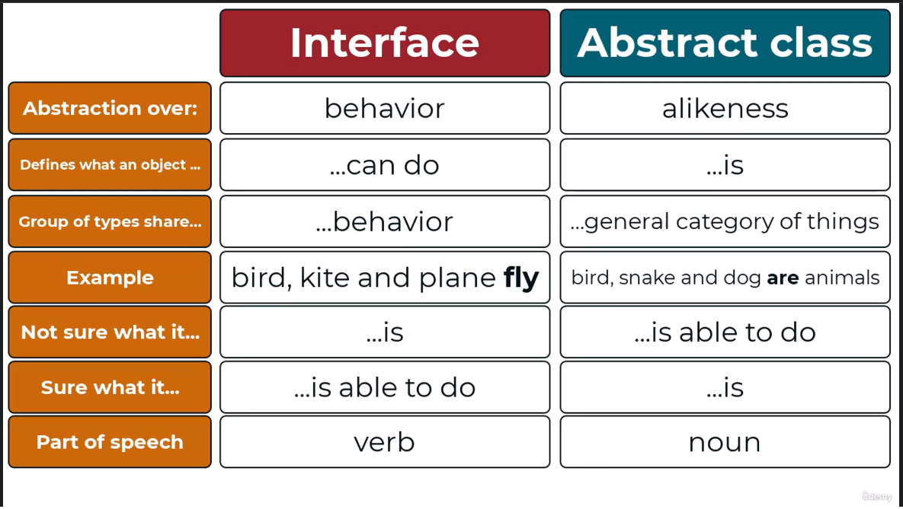
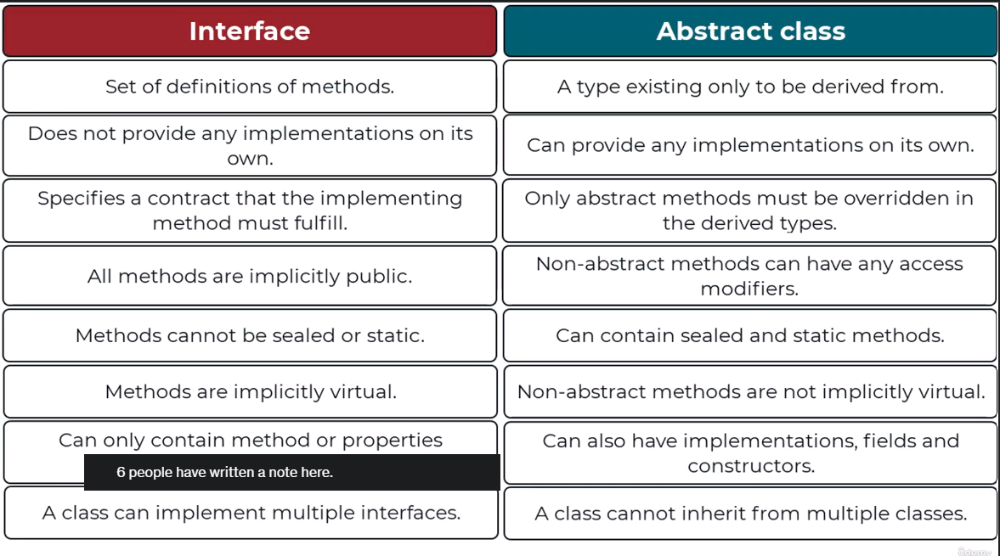

# Basic OOPs Concepts

## Method Overloading

When methods in a class defined with same name but different parameter types is called Method overloading.  
**Note - Methods defined with the same name but different return type doesn't result into Method overloading, parameter types should be different along with the same method name.**

## readonly and const

**If a field is readonly** then it can be modified while declaration and inside the constructor only. Value decided at the runtime.   
E.g. a person name in an instance representing that person can be readonly as the person name after initialzation (in constructor) is not likely to be modify within that instance.

**If a variable or field is const** (must be initialized while declaration) then cannot be modified in any instances. Value decided at the compile time, and *value should be a compile time constant (values available at compile time not at runtime).*  
E.g. number of sides of the rectangle, it will be same for all the instances.

**All const fields are implicitly static.**

## static class and static methods
If a class contains only static methods then the class can be made as static. The static class cannot be instantiated.

## Difference between abstract method and virtual method

## Difference between interface and abstract class

## Single Responsibility (S in SOLID Principles)

- There should be single reason to change a class.
- 

## Dependency Inversion (D in SOLID Principles)

It says that a class should depend on abstractions, not on concrete types means the dependencies should be abstractions instead of being concrete.

## Dependency Injection (Design Pattern)

It says a class should given dependencies when it needs, it should not create it itself.

